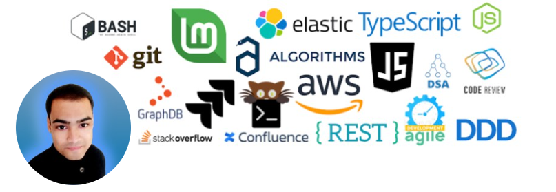

<h1 align="left" id="ankurksoni-title">Hello there! 👋 I'm Ankur Soni</h1>
<h3 align="left">I do Backend Engineering things</h3>

  
  
  
    

<h2 align="left" id="ankurksoni-tech">Favorite Tech</h2>

> Tools, languages, and other things that I like to work with.

<table>
  <tr>
    <td align="center" width="96">
      
       AWS
    </td>
    <td align="center" width="96">
      
       Node.js
    </td>
    <td align="center" width="96">
      
       linux
    </td>
    <td align="center" width="96">
      
       TypeScript
    </td>
    <td align="center" width="96">
      
       DB
    </td>
    <td align="center" width="96"> 
      
       Docker
    </td>
    <td align="center"  width="96">
      
       Elasticsearch
    </td>
    <td align="center" width="96">
      
       Git
    </td>
  </tr>
</table>

<h2 align="left" id="ankurksoni-tech">Bit more about me</h2>

---
  
## 🚀 **Backend Engineering Leader | System Architect | 10+ Years Experience | Node.js | TypeScript | AWS | Scalable Systems**

I specialize in **AI-first, fast-paced backend development** and have built **robust, scalable systems** that are architecturally sound and performance-optimized. Over the past decade, I’ve led critical engineering efforts that drive measurable business impact through technical excellence and clean design.

---

## 🔧 Core Strengths

- 🚀 Microservices architecture, gRPC services & event-driven systems  
- 🚀 Deep expertise in **Node.js**, **TypeScript**, **PostgreSQL**, and **MongoDB**  
- 🚀 AWS Cloud infrastructure and distributed systems at scale  

---

## 🛠️ Core Technical Skills

### 🤖 AI & Tooling
- OpenAI API
- Cursor IDE

### 🧰 Backend Development
- Node.js, TypeScript, JavaScript
- NestJS, Nx Monorepo

### 🗄️ Databases
- PostgreSQL 🐘
- MongoDB 🍃
- Elasticsearch 🔍

### ☁️ Cloud & DevOps
- AWS ☁️
- Docker 🐳
- Ansible 🧰

### 📨 Message Brokers
- Apache Kafka 🔁
- AWS SQS 📬

### 🌐 Network Protocols
- WebSockets 🔌
- Server-Sent Events (SSE) 🔄
- RESTful APIs 🌐
- HTTP/2 ⚡
- gRPC 📡

---

## 💡 Key Highlights

- ⚙️ **Sidecar Pattern Implementation**: Designed gRPC + API server separation, boosting response efficiency by **2×**
- 🧩 **Monolith to Microservices**: Led migration effort, increasing deployment agility by **3×**
- 🔍 **Query Optimization**: Tuned MongoDB, PostgreSQL, MSSQL queries, cutting average response time by **40%**
- ⚡ **Caching Strategy**: Integrated DynamoDB and Memcache layers, reducing latency by **35%**
- 🧑‍🏫 **Team Leadership**: Mentored teams of **5–8 engineers**, delivering high-quality output with clear technical direction
- 🚀 **Ansible Automation**: Engineered CI/CD deployments, accelerating provisioning speed by **8×**
- 🔗 **Data Migrations**: Designed scalable migration workflows for millions of records using AWS-native tools
- 📘 **Documentation Excellence**: Produced API specs, architecture blueprints, and ops runbooks recognized for clarity and maintainability

---

## 🎯 What I’m Looking For

I bring a **hands-on leadership mindset** with a passion for **clean system design**, **performance optimization**, and **team mentorship**. I’m currently exploring **backend-focused opportunities** where **quality, scale, and clarity** are non-negotiable values.

---

📫 Feel free to connect or reach out if you’re building something exciting in the backend or AI space!

<!--
**ankurksoni/ankurksoni** is a ✨ _special_ ✨ repository because its `README.md` (this file) appears on your GitHub profile.

Here are some ideas to get you started:

- 🔭 I’m currently working on ...
- 🌱 I’m currently learning ...
- 👯 I’m looking to collaborate on ...
- 🤔 I’m looking for help with ...
- 💬 Ask me about ...
- 📫 How to reach me: ...
- 😄 Pronouns: ...
- ⚡ Fun fact: ...
-->
